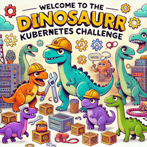

# Suse Observability Challenges

This repository contain various kubernetes challenges that showcase's Suse Observaility and its troubleshooting capabilities.



## Dino Adventures that wait

- [Broken Brontosaurus](./labs/broken-brontosaurus/assignment.md)
    - Troubleshoot crashback loop
- [Forgetasaurus](./labs/forgetasaurus/assignment.md)
    - Troubleshoot memory issues
- [Dino Diner](./labs/dino-diner/assignment.md)
    - Troubleshoot slow responses using traces
- [Jurassic Net](./labs/jurassic-net/assignment.md)
    - Troubleshoot slow responses and 5xx http errors without traces
- [Stegostorage](./labs/stegostorage/assignment.md)
    - Troubleshoot pending state
- [Configosaurus](./labs/configosaurus/assignment.md)
    - Troubleshoot application behaviour in relation to config


## Prerequisites

- [Taskfile](https://taskfile.dev/installation/)
- [Helm](https://helm.sh/docs/intro/install/)
- [Lima](https://lima-vm.io/docs/installation/)

You will also need access to a Suse Observability instance.

> [!TIP]
> `task` supports tab completion

## Environment 

Create a `.env` file 

```bash
cp .env.example .env
```

Change the content with details about your environment.

```bash
CLUSTER_NAME=lab-test  # Suse Observability Kubernetes StackPack instance name
STS_URL=https://xxx-lab.app.stackstate.io
STS_API_KEY=tmnpPT69Z
OTEL_ENDPOINT=otel-xxx-lab.app.stackstate.io:443
```

## Local Cluster

You can test or try out challenges on a local k3s instance using Lima. 
Use the predefined tasks to manage the vm

```bash
# create the vm
task local:create-vm

# Install Suse Observability Agent
task local:deploy-observability-agent

# Install Open Telemetry Agent
task local:deploy-otel-agent

# stop the vm
task local:stop-vm

# start the vm
task local:start-vm

# setup local kubectx 
eval $(task local:shell-env)
kubectl get nodes

# destroy the vm
task local:destroy-vm

```

## Running a challenge

Challenges are run using predefined task for the challenge that have the pattern,

```bash
# Read the challenge instructions
task labs:< name of challenge>:assignment

# The inststructions will generally lead to 3 setups you need to perform in environment

# 1) Setup the challenge.
task labs:<name of challenge>:setup 

# 1.1) Sometimes there will be a trigger 
task labs:<name of challenge>:trigger

# 2) Resolve the challenge
task labs:<name of challenge>:resolve

# 3) Tear down the challenge
task labs:<name of challenge>:teardown

```

## Pre-staging Scenarios

When doing an interactive workshop with a large group in a short amount of time, it may not be practical to do the challenges
in an online learning platform where each individual has their own environment.

Instead, we could create a single login account in Suse Observability for all participants and use time travel for candidates 
to explore error and healthy states of the challenges.

The challenges can be pre-staged with healthy and error states with predictable timings.

```bash
# Will delete all namespaces that were used by previous labs
scenario:clean

scenario:setup-brontosaurus


```


> [!WARNING]
> Some assignments are written to primarily use Rancher Manager and Suse Observability from a learning platform. For testing however, we can
> use the Helm Charts directly instead of doing it through Rancher. 
